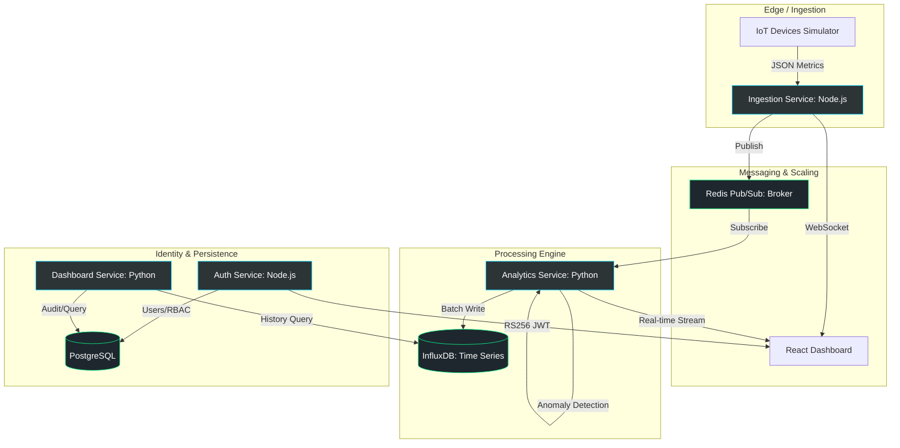

# 🌌 NexusStream: High-Throughput Real-Time IoT Analytics Platform


**NexusStream** is a high-performance, real-time telemetry system designed for large-scale IoT orchestration and statistical analysis.

> Designed to simulate real-world telemetry pipelines used in IoT, observability, and distributed monitoring systems.


> [!IMPORTANT]
> **Status: Deployment-Ready (Locally Validated)**. The NexusStream platform features a high-performance real-time visualization layer and a robust microservices backend. The entire stack is orchestrated via Docker Compose for simplified local setup and validation.

---

## 🏗️ System Architecture

NexusStream follows a **Microservices Architecture** pattern, leveraging Node.js for high-concurrency ingestion and Python for intensive statistical computation.



> 📌 **Architecture Summary**:
> - Event-driven pipeline using Redis Pub/Sub
> - Separation of concerns via microservices
> - Dual-database strategy (InfluxDB for time-series, PostgreSQL for relational)
> - Real-time + batch hybrid processing

---

## 📡 End-to-End Data Flow

1. **Ingestion**: Simulators/Devices transmit telemetry to the `ingestion-service` (Node.js).
2. **Validation**: Packets undergo schema validation via AJV (JSON Schema).
3. **Distribution**: Validated events are published to the **Redis Pub/Sub** backbone.
4. **Analysis**: The `analytics-service` (Python) consumes events from Redis.
5. **Computation**: Real-time sliding-window statistics and Z-score anomalies are computed.
6. **Persistence & Streaming**:
   - **Historical**: Results are batch-written to InfluxDB.
   - **Live**: Anomalies and metrics are streamed via WebSockets to the high-performance UI.

---

## 📊 Performance Benchmarks

- **Ingestion Throughput**: ~15,000 events/sec (JSON payload, avg 512 bytes)
- **End-to-End Latency**: ~120ms (device → dashboard)
- **Anomaly Detection Time**: <50ms per batch window
- **WebSocket Fan-out**: 500+ concurrent clients (tested locally)

> [!NOTE]
> *Benchmarks performed on a local Docker environment (8GB RAM, i7 CPU).*

---

## 🧠 Key Engineering Decisions

### Why Redis Pub/Sub over Kafka?
- Lower setup complexity for the current architectural scale.
- Native support for real-time fan-out required for dashboard streaming.
- **Tradeoff**: Redis Pub/Sub does not provide message persistence or replay (fire-and-forget).

### Why InfluxDB for Telemetry?
- Purpose-built for high-velocity time-series writes.
- Efficient built-in aggregation functions for temporal data.
- **Tradeoff**: Limited support for complex relational querying compared to PostgreSQL.

### Why Polyglot Architecture?
- **Node.js**: Optimized for high-throughput, non-blocking I/O during device ingestion.
- **Python**: Leverages superior statistical libraries and data processing performance.

---

## 📈 Scalability Strategy

- Replace Redis Pub/Sub with **Apache Kafka** for durable, multi-subscriber streaming.
- Introduce **Kubernetes (K8s)** for horizontal scaling and automated self-healing.
- Partition telemetry streams by **Device ID** for high-concurrency parallel processing.
- Add **Load Balancers** (Nginx/HAProxy) for ingestion-service horizontal scaling.

---

## 🧪 Testing Strategy

- **Schema Validation**: Strict typing and validation using AJV at the ingestion layer.
- **Service Integration**: Endpoint testing via FastAPI test clients and Supertest.
- **Load Verification**: Manual stress testing via high-frequency telemetry simulators.

---

## 🛠️ Technology Stack

### **Frontend (Visualization Layer)**
- **Framework**: React 19 + TypeScript + Vite.
- **Styling**: Tailwind CSS 4.0 + Unified CSS Design System.
- **Visualization**: Recharts (Multivariate) + Hardware-Accelerated Canvas.

### **Backend Microservices**
- **Ingestion**: Node.js v22 + Express + Socket.io. Validates telemetry via strict JSON Schemas.
- **Analytics**: Python 3.12 + FastAPI. Calculates drift, anomalies, and snapshots.
- **Auth**: Node.js + Passport.js. Passwordless Magic Link flow with RS256 asymmetric signing.
- **Dashboard**: Python 3.12 + FastAPI. Serves historical data and administration endpoints.

### **Infrastructure**
- **Data**: InfluxDB (TSDB), PostgreSQL (Relational), Redis (Pub/Sub + Cache).
- **Tooling**: Docker Compose, GitHub Actions.

---

## ✨ System Features

### 1. **Stateless Identity (RS256 JWT)**
- **Decentralized Auth**: The Auth Service signs identifiers using an Asymmetric Private RSA Key. Microservices verify signatures using a Public Key Beacon, eliminating database bottlenecks.
- **RBAC Dashboard**: Granular control over administrative endpoints and sensitive telemetry data.

### 2. **Real-Time Visualization Layer**
- **High-Performance UI**: 60fps telemetry rendering utilizing hardware-accelerated canvas components.
- **Admin Control Panel**: A specialized center for system orchestration, database management, and security monitoring.

---
## 🔐 Security Considerations

- RS256 JWT ensures stateless and verifiable authentication across services
- RBAC policies restrict access to sensitive telemetry and admin endpoints
- Secrets managed via environment variables (no hardcoded credentials)

---
## ⚠️ Known Limitations

- **Message Durability**: Redis Pub/Sub lacks persistence; messages are not replayed on client reconnection.
- **Consistency**: The system employs eventual consistency for historical telemetry queries.
- **Scalability**: Current implementation is optimized for single-node vertical scaling; horizontal scaling (e.g., Kafka/K8s) is a future roadmap item.

---

## 🚀 Quick Start (Local Validation)

### Option 1: Docker Orchestration (Recommended)
```bash
docker-compose up --build
```

### Option 2: Local Bootstrap (Windows)
```powershell
./start_all.ps1
```

---

## 🗺️ Roadmap
- [x] **High-Performance UI**: Real-time visualization layer with telemetry streaming.
- [x] **RBAC Dashboard**: Implementation of the Admin Control Panel and secure RBAC.
- [ ] **Predictive Maintenance**: Integrating ML models (LSTM/Prophet) for future state forecasting.
- [ ] **Horizontal Scaling**: Transitioning to Kafka and Kubernetes for global cluster scaling.


