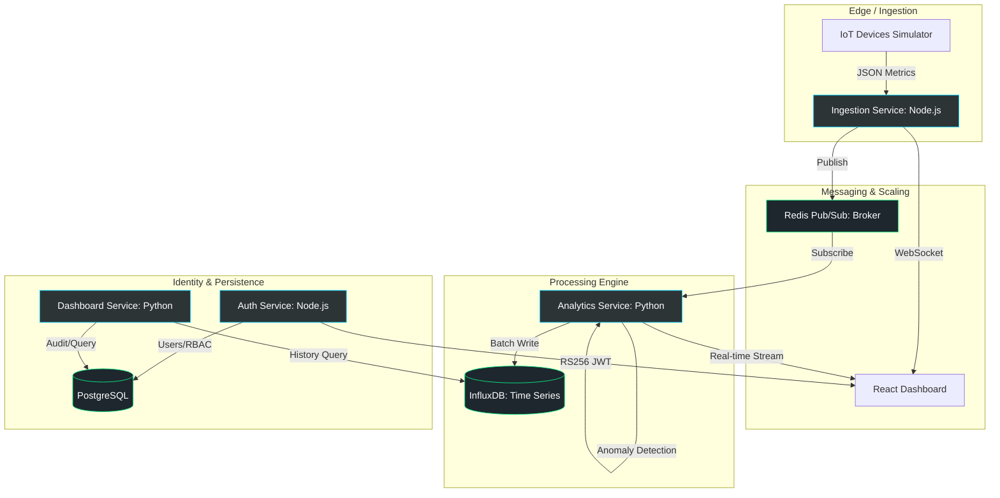

# 🌌 NexusStream: Advanced IoT Analytics & Orchestration Platform


**NexusStream** is a high-performance, industrial-grade IoT analytics platform designed to handle massive telemetry streams with real-time anomaly detection, secure identity management, and a premium "VisionTrack" dashboard interface.

---

## 🏗️ System Architecture

NexusStream follows a **Microservices Architecture** pattern, leveraging the strengths of both Node.js (for high-concurrency I/O points) and Python (for data-intensive analytics).



---

## 🛠️ Technology Stack

### **Frontend (The "VisionTrack" UI Kit)**
- **Framework**: React 19 + TypeScript + Vite.
- **Styling**: Tailwind CSS 4.0 + Vanilla CSS (for premium glassmorphism effects).
- **State Management**: Zustand (lightweight, high-performance global state).
- **Visualization**: Recharts (for multivariate telemetry) + custom Canvas-based orbital widgets.
- **Icons**: Lucide React.

### **Backend Services**
- **Ingestion Service**: Node.js v20 + Express + Socket.io. Validates packets using AJV (JSON Schema) before publishing to Redis.
- **Analytics Service**: Python 3.11 + FastAPI. Implements moving-average filters, sliding-window statistics, and Z-score anomaly detection.
- **Auth Service**: Node.js + Passport.js. Features Magic Link (passwordless) login, Google/GitHub OAuth, and RS256 asymmetric token signing.
- **Dashboard Service**: Python + FastAPI. Serves historical data queries and manages device registry interactions.

### **Infrastructure & Data**
- **Orchestration**: Docker Compose with health-aware dependency graphs.
- **Redis**: Used as the primary message broker (Pub/Sub) and metrics cache.
- **PostgreSQL 16**: Relational storage for users, RBAC roles, and device metadata.
- **InfluxDB 2.7**: High-ingestion time-series database for telemetry storage.
- **RabbitMQ**: (Optional) Secondary broker for message queuing.

---

## ✨ Key Features & Logic

### 1. **Stateless Authentication (RS256 JWT)**
NexusStream prioritizes security with a decentralized identity model.
- **The Approach**: The Auth Service issues JWTs signed with a Private RSA key. Other services (Analytics, Dashboard) verify these tokens using a Public Key. This eliminates recursive database lookups for auth validation on every API call.
- **Methods**: Integrated Magic Link flow for passwordless entry and Multi-provider OAuth2.

### 2. **Real-time Telemetry Pipeline**
- **The Logic**: IoT packets flow from simulators into the `ingestion-service`. Each packet is validated against a strict JSON schema. Once validated, it is broadcasted over WebSockets for immediate visualization and published to Redis for downstream processing.
- **Resilience**: A ring-buffer mechanism ensures no data is lost during momentary Redis disconnections.

### 3. **Intelligent Analytics Engine**
- **The Approach**: The `analytics-service` maintains a sliding temporal window of telemetry. It identifies "Statistical Outliers" by comparing incoming values against the historic mean and standard deviation of that specific device.
- **Database Hybridization**: Uses **PostgreSQL** for relational metadata and **InfluxDB** for high-frequency time-series data, ensuring the best tool is used for each task.

### 4. **Premium Design Language**
- **Aesthetic**: "Urban Ethereal" – using deep-space backdrops, glassmorphism cards, and liquid-smooth animations.
- **UX**: Micro-interactions provide instant feedback, making the complex data feel intuitive and alive.

---

## 📂 Project Structure

```text
nexusstream/
├── services/
│   ├── ingestion-service/    # Node.js: Gateway for IoT telemetry
│   ├── analytics-service/    # Python: Statistical engine & Anomaly detection
│   ├── auth-service/         # Node.js: Identity & Access Management
│   └── dashboard-service/    # Python: Data retrieval layer
├── frontend/                 # React 19: VisionTrack Premium Dashboard
├── databases/                
│   ├── postgres/             # User & Device relational schemas
│   └── redis/                # Pub/Sub networking configuration
├── docker-compose.yml        # Service orchestration & networking
└── start_all.ps1             # Automated startup script
```

---

## 🚀 Getting Started

1. **Clone the Project**:
   ```bash
   git clone <repository-url>
   cd nexusstream
   ```

2. **Environment Setup**:
   Map your secrets in `.env` (use `.env.example` as a reference).

3. **Power Up**:
   ```bash
   docker-compose up --build
   ```

4. **Web Endpoints**:
   - Dashboard: [http://localhost:5173](http://localhost:5173)
   - API Docs: [http://localhost:8001/docs](http://localhost:8001/docs)

---

## 📈 Technical Analysis: Pros & Cons

### **Pros**
- ✅ **Decoupled Scaling**: Ingest spikes don't lag the UI.
- ✅ **Polyglot Advantage**: High-performance I/O in Node, Data Science in Python.
- ✅ **Infrastructure-as-Code**: Entire stack is containerized for zero-friction boarding.
- ✅ **Enterprise Security**: Asymmetric JWT signatures and RBAC.

### **Cons**
- ⚠️ **Operational Overhead**: Requires managing four distinct service environments.
- ⚠️ **Network Latency**: Inter-service communication adds millisecond overhead compared to monoliths.
- ⚠️ **Consistency**: Telemetry data is "eventually consistent" in historical reports.

---

## 🎨 Design Philosophy
NexusStream was built to prove that **Modern Infrastructure deserves Modern Design.** We use vibrancy and depth to turn abstract data into a premium user experience.
