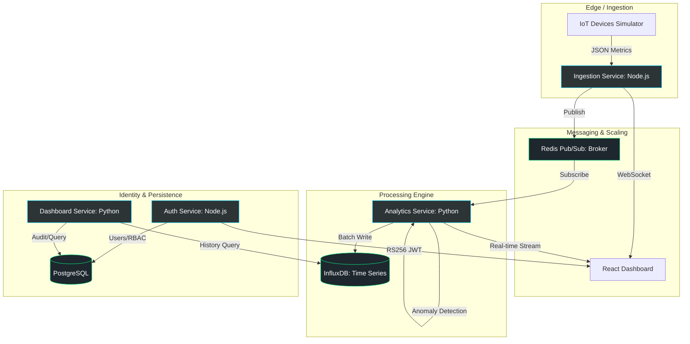

# 🌌 NexusStream: Advanced IoT Analytics & Orchestration Platform


**NexusStream** is a high-performance, industrial-grade IoT analytics platform. 


> [!IMPORTANT]
> **Production Ready / Stable**: The NexusStream platform is fully operational, featuring a high-fidelity **VisionTrack Command Hub** and a robust microservices backend. The entire stack is orchestrated via Docker, providing a seamless "Zero-Configuration" environment for real-time IoT telemetry and high-security administrative control.

---

## 🏗️ System Architecture

NexusStream follows a **Microservices Architecture** pattern, leveraging the strengths of both Node.js (for high-concurrency I/O points) and Python (for data-intensive analytics).



---

## 🛠️ Technology Stack

### **Frontend (The "VisionTrack" UI Kit)**
- **Framework**: React 19 + TypeScript + Vite.
- **Styling**: Tailwind CSS 4.0 + Vanilla CSS (for premium glassmorphism effects).
- **State Management**: Zustand (lightweight, high-performance global state).
- **Visualization**: Recharts (for multivariate telemetry) + custom Canvas-based orbital widgets.
- **Icons**: Lucide React.

### **Backend Services**
- **Ingestion Service**: Node.js v22 + Express + Socket.io. Validates incoming telemetry against rigid JSON Schemas (AJV) before broadcasting to the Redis Pub/Sub backbone.
- **Analytics Service**: Python 3.12 + FastAPI. The platform's brain, calculating sliding-window drift, Z-score anomalies, and statistical snapshots in real-time.
- **Auth Service**: Node.js + Passport.js. Implements a secure **Passwordless Magic Link** flow with RS256 asymmetric JWT signing.
- **Dashboard Service**: Python 3.12 + FastAPI. The data orchestration layer, serving historical telemetry and administrative cache management.

### **Infrastructure & Data**
- **Orchestration**: Docker Compose with health-aware dependency graphs.
- **Redis**: Used as the primary message broker (Pub/Sub) and metrics cache.
- **PostgreSQL 16**: Relational storage for users, RBAC roles, and device metadata.
- **InfluxDB 2.7**: High-ingestion time-series database for telemetry storage.
- **RabbitMQ**: (Optional) Secondary broker for message queuing.

---

## ✨ Key Features & Logic

### 1. **Stateless Identity (RS256 JWT)**
NexusStream eliminates database bottlenecks via a decentralized security model.
- **The Approach**: The Auth Service signs identifiers using an **Asymmetric Private RSA Key**. External microservices (Analytics, Dashboard) verify these signatures using a **Public Key Beacon**, allowing for zero-delay authorization without hitting the central database.
- **Admin Authority**: A specialized RBAC system allows for granular control over holographic widgets and administrative data views.

### 2. **Real-time Telemetry Pipeline**
- **The Logic**: IoT packets flow from simulators into the `ingestion-service`. Each packet is validated against a strict JSON schema. Once validated, it is broadcasted over WebSockets for immediate visualization and published to Redis for downstream processing.
- **Resilience**: A ring-buffer mechanism ensures no data is lost during momentary Redis disconnections.


### 3. **Intelligent Analytics Engine**
- **The Approach**: The `analytics-service` maintains a sliding temporal window of telemetry. It identifies "Statistical Outliers" by comparing incoming values against the historic mean and standard deviation of that specific device.
- **Database Hybridization**: Uses **PostgreSQL** for relational metadata and **InfluxDB** for high-frequency time-series data, ensuring the best tool is used for each task.

### 4. **Holographic Command Hub**
- **Aesthetic**: "Ethereal Urbanist" – using deep-space backdrops, liquid glassmorphism, and live holographic radar sweeps.
- **Admin Authority Vault**: A specialized control center for administrators featuring Database Shard Matrixes, Security Core Scans, and Authorized Command Indicies.
- **Micro-Animations**: Real-time "Scroll-Reveal" transitions and 60fps telemetry rendering via hardware-accelerated canvas.

---

## 📂 Project Structure

```text
nexusstream/
├── services/
│   ├── ingestion-service/    # Node.js: Gateway for IoT telemetry
│   ├── analytics-service/    # Python: Statistical engine & Anomaly detection
│   ├── auth-service/         # Node.js: Identity & Access Management
│   └── dashboard-service/    # Python: Data retrieval layer
├── frontend/                 # React 19: VisionTrack Premium Dashboard
├── databases/                
│   ├── postgres/             # User & Device relational schemas
│   └── redis/                # Pub/Sub networking configuration
├── docker-compose.yml        # Multi-service production orchestration
├── .env.example              # Template for secure environment variables
└── start_all.ps1             # Local development bootstrap script
```

---

## 🚀 Quick Start

### Option 1: Local One-Click Startup (Windows)
If you are on Windows, you can start the entire stack (including Redis and the Frontend) with a single script:
```powershell
./start_all.ps1
```
This script will spawn multiple windows for:
- **Redis & Postgres** (Local/Docker Instances)
- **Ingestion & Auth** (Node.js Environment)
- **Analytics & Dashboard** (Python 3.12 Virtual Envs)
- **VisionTrack UI** (Vite / React 19)

### Option 2: Docker Orchestration
If you have Docker installed, use the orchestration file:
```bash
docker-compose up --build
```

---

## ⚙️ Manual Service Startup

### 1. Prerequisite: Databases
Ensure **PostgreSQL** is running. If you need to initialize the schema:
```powershell
python setup_postgres.py
```

### 2. Start Services Individually
If you want to run services manually for debugging:

**Backend (Node.js):**
```bash
cd services/auth-service && npm run dev
cd services/ingestion-service && npm run dev
```

**Analytics (Python):**
```bash
cd services/analytics-service
# On Windows
.\.venv\Scripts\activate
uvicorn main:app --reload --port 8001
```

**Frontend:**
```bash
cd frontend && npm run dev
```
---

## 🎨 Design Philosophy
NexusStream was built to prove that **Modern Infrastructure deserves Modern Design.** We use vibrancy and depth to turn abstract data into a premium user experience.


---

## 🗺️ Roadmap
NexusStream is evolving. Our current focus is on enhancing the user experience and deep-data insights:
- [x] **Advanced Frontend**: Finalizing the "VisionTrack" dashboard with live holographic sweeps.
- [x] **Secured Command**: Implementing the Admin Authority Vault and RBAC persistence.
- [ ] **Predictive Maintenance**: Integrating ML models (LSTM/Prophet) to predict device failure.
- [ ] **Mobile App**: Developing a Flutter-based mobile companion for field engineers.
- [ ] **Global Scaling**: Multi-region Kubernetes (k8s) cluster deployment.

---


> [!TIP]
> **Performance Tip**: For production deployments, ensure `NODE_ENV` and `PYTHON_ENV` are set to `production` to enable optimized building and logging.
